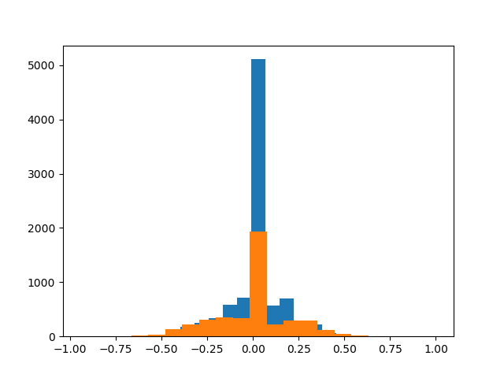

#**Behavioral Cloning**

## TL;DR Lessons learned

- Final training was done using "udacity" and own "soft_recovery" (Where I drove
  from the side (**not** the dirt) of the track to the middle). Instead of adding
  more and more data **check all other parameters first**. More trainingdata just
  increases the iteration time and does not improve a shitty classifier.
- Dropoff does not work in this case - car keeps falling off.
- Regularization is good.
- Auto-stoping is great.

## Prequiries

install missing packages not part of anaconda distribution

    pip install python-socketio
    pip install eventlet

### Potential errors

- poor predictions on training and validating -> underfitting -> more layers, more epochs
- poor on validation -> overfitting -> dropout, fewer convolutions, fewer fully connected, collect more data & augment

**Behavioral Cloning Project**

The goals / steps of this project are the following:
* Use the simulator to collect data of good driving behavior
* Build, a convolution neural network in Keras that predicts steering angles from images
* Train and validate the model with a training and validation set
* Test that the model successfully drives around track one without leaving the road
* Summarize the results with a written report

---
### Files Submitted & Code Quality

#### 1. Submission includes all required files and can be used to run the simulator in autonomous mode

My project includes the following files:
* model.py containing the script to create and train the model
* drive.py for driving the car in autonomous mode
* model.h5 containing a trained convolution neural network
* writeup_report.md or writeup_report.pdf summarizing the results

#### 2. Submission includes functional code
Using the Udacity provided simulator and my drive.py file, the car can be driven autonomously around the track by executing
```sh
python drive.py model.h5
```

#### 3. Submission code is usable and readable

The model.py file contains the code for training and saving the convolution neural network. The file shows the pipeline I used for training and validating the model, and it contains comments to explain how the code works.

### Model Architecture and Training Strategy

#### 1. An appropriate model architecture has been employed

My model is based on the [NVIDIA net](https://arxiv.org/pdf/1604.07316v1.pdf)
which was developed specifically for autonomous driving tasks. The original
NN looked like follows:


The model includes ELU layers to introduce nonlinearity, and the data is normalized in the model using a Keras lambda layer. Also, images are cropped: 70px at the top
of the images (unnecessary sky, trees, etc.) and 25px at the bottom (hood of
the car) are not used for training, since carrying no helpful (or even
distracting) information.

#### 2. Attempts to reduce overfitting in the model

To prevent overfitting like displayed in the following image, I tried out **dropout** (but it didn't work) after every Convolution and fully-connected network layer !

The model was trained and validated on different data sets to ensure that the model was not overfitting. The model was tested by running it through the simulator and ensuring that the vehicle could stay on the track.

#### 3. Model parameter tuning

The model used an adam optimizer that implements **weight decay**, so the learning rate was not tuned manually. An initial `LEARNING_RATE = 0.0001` yielded best results.

#### 4. Appropriate training data

Training data was chosen to keep the vehicle driving on the road. I used a combination of

- the udacity dataset
- a dataset of myself driving from the side to the center of the road (recovery)

What I recorded (and didnt end up using)
- a different person drove 2 laps on track 1 forward.
- a different person drove 2 laps on track 1 backwards.
- a different person drove 2 laps on track 2 forward.
- a different person drove 2 laps on track 2 backwards.
- I'm driving the crital part (exit to dust road couple of times in both directions).
- I'm driving in the center for 2 laps forward.
- I'm driving in the center for 2 laps backwards.
- I'm driving 1 laps, recording is only turned on when recovering from dirt back to
 the road.
- I'm driving around curves when red/white road marking is present.

Each stored in a separate sub-folder to allow to use all, or only a subset of
training patterns. For each training sample,
I added a flipped version with inverted steering angle to the training set as well.
This serves two purposes: Balancing the dataset between left and right steering
actions and generating more training data.

### Model Architecture and Training Strategy

#### 1. Solution Design Approach

The overall strategy for deriving a model architecture was to use a Deep neural
network that already prooved itself suitable on simiar data.

My first step was to use a convolution neural network model similar to the NVIDIA-Net.
I thought this model might be appropriate because it was developed for autonomous
driving.

In order to gauge how well the model was working, I split my image and steering angle data into a training and validation set. I found that my first model had a low mean squared error on the training set but a high mean squared error on the validation set. This implied that the model was overfitting.

To combat the overfitting, I implemented
**dropout** after every Convolution and fully-connected network layer.

Then I implemented **early stopping** to stop training when the performance converges (and neither earlier wasting model performance nor later wasting time). This is configuration `EarlyStopping(monitor='val_loss', min_delta=0.001, patience=5, verbose=0, mode='auto')` I used.

The final step was to run the simulator to see how well the car was driving around track one. There were a few spots where the vehicle fell off the track. To improve the driving behavior in these cases, I recorded myself passing them a few times. Examples were
the exit to the dirt road and some places where the street was marked by white/red
areas.

At the end of the process, the vehicle is able to drive autonomously around the track without leaving the road.

#### 2. Final Model Architecture

The final model architecture was a modification of the [NVIDIA net](https://arxiv.org/pdf/1604.07316v1.pdf). Instead of having 4 fully-connected
layers with 1164/100/50 and 10 neurons at the end, I ended up using 120//50/10 and 1
neuron. This combination was the result of a long trial-and-error periode. I **DID NOT** use dropoff.

Here is a visualization of the architecture (note: visualizing the architecture is optional according to the project rubric)


The training took 25 minutes.


#### 3. Creation of the Training Set & Training Process

The udacity dataset already existed.

I then recorded the vehicle recovering from the left side and right sides of the
road back to center for two laps so that the vehicle would learn to steer back to the center
These images show what a recovery looks like starting from the curbs.


Then I repeated this process on track two in order to get more data points.

I used a XBOX 360 controller analog-pad to steer (instead of a binary WASD control).

To augment the data sat and to balance the proportion of steering movements to
the left and to the right, I also flipped images and angles. For example,
here is an image that has then been flipped:


I also balanced the dataset by calculating the avery number of samples per steering
angle bin. Each sample from each bin had a probability to be kept of
`avg_per_bin / n_per_bin` to cut away all the "zero" steering angle samples
(blue is before, orange after):



I finally randomly shuffled the data set and put 20% of the data into a validation set.

I used this training data for training the model. The validation set helped determine if the model was over or under fitting. I set the number of epochs to 50 and implemented
early stopping as mentioned above. I used an adam optimizer so that manually training the learning rate wasn't necessary.

### Info for myself: failures

- 03 to 04: Reduced Dense from 120/50/10/1 to 120/64/1. Much less overfitting.
- 05: Reduced correction from 0.1 to 0.05
- 06: Removed "bernhard_forward_center2", "bernhard_reverse_center2"
- 07: Removed "bernhard_critical_part", increased ``EPOCHS`` from 5 to 10
- 08: ``EPOCHS`` back to 5, "annika_reverse", "annika_forward", "bernhard_critical_part",
"bernhard_forward_center2", "bernhard_reverse_center2",
"bernhard_forward_recovery"
- 09: From ``lr=0.0001`` ``to lr=0.001``, added "bernhard_red", "annika_2_reverse", "annika_2_forward
- 11: Removed 2nd ``Conv2D(64, (3, 3))``
- 12: Removed 2 Dense layer from NVIDIA net (2 remaining (64/1))
